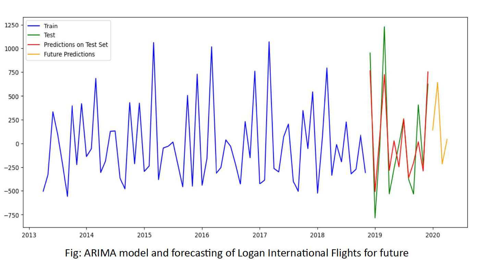

# Boston's Economic Diary - Time Series Analysis & Forecasting

## Result


## Overview
Boston’s Economic Diary is a data-driven analysis project that examines economic trends in Boston, focusing on Logan Airport traffic and hotel occupancy rates. Using time series analysis and forecasting models, this project uncovers key insights into economic activity, helping stakeholders make data-informed decisions.

## Features
- Time Series Forecasting: Implemented ARIMA models to predict trends.
- Economic Trend Evaluation: Used statistical tests to assess data stationarity and correlations.
- Data Visualization: Created meaningful visualizations with Matplotlib to present trends.
- Statistical Methods: Applied ADF test, correlation analysis, and time series decomposition.

## Technology Used
- Python
- Pandas – Data manipulation and analysis
- NumPy – Numerical computations
- Matplotlib – Data visualization
- SciPy – Statistical analysis
- Statsmodels – ARIMA modeling and statistical testing
- tensorflow.keras – Neural Network Model

## Methodology
1. Data Collection & Preprocessing
- Loaded historical data on airport traffic and hotel occupancy rates.
- Cleaned and transformed data using Pandas.

2. Exploratory Data Analysis (EDA)
- Visualized trends and seasonality using Matplotlib.
- Analyzed correlations between different economic indicators.

3. Statistical Testing & Model Selection
- Performed ADF test to check for stationarity.
- Applied time series decomposition to identify seasonality and trends.
- Selected and optimized ARIMA models for forecasting.

4. Forecasting & Insights
- Used ARIMA to predict future economic activity.
- Interpreted results to provide actionable insights for business and policymakers.

## Future Improvements
- Extend analysis to other economic indicators (e.g., employment rates, tourism trends).
- Experiment with LSTM and Prophet models for improved forecasting.
- Develop an interactive dashboard for real-time insights.

## **Clone the Repository**:
   ```bash
   git clone https://github.com/shubham-singh0109/Time_Series_Analysis_Predicting-Forecasting.git
   ```
   ```bash
   cd Time_Series_Analysis_Predicting-Forecasting
   ```

## Contributions
Contributions are welcome! Please fork the repository and submit a pull request.
